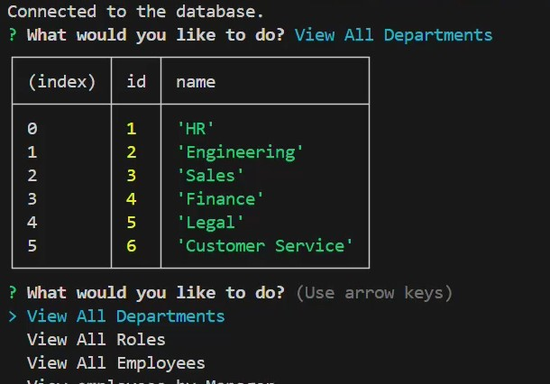

# Employee SQL Database 
  
  ## Description
  Console application to view and manage an employee database.
  ## Deployed Application URL
  n/a
  ## Screenshot
  
  ## Table of Contents
  * [Features](#features)
  * [Languages & Dependencies](#languagesanddependencies)
  * [Usage](#Usage)
  * [Contributors](#contributors)
  * [Testing](#testing)
  * [Questions](#questions)
  ## Features
  View/Add functionality on employee database. **Special feature: List all employees by manager**
  ## Languages & Dependencies
  console.table, dotenv, inquirer, mysql
  ## Usage:
  javascript, sql
  ## Contributors
  n/a
  ## Testing
  npm run setup-db, npm run seed-db to create and seed database. db credentials will need to be added to .env file
  ## Questions
  Please send your questions [here](mailto:sondavid85@yahoo.com?subject=[GitHub]%20Dev%20Connect) or visit [github/sondavid85](https://github.com/sondavid85).
  